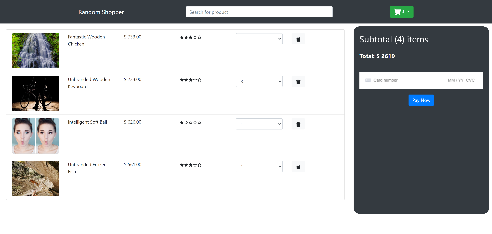

# Shopping-site 

https://github.com/dthompasionas/Shopping-site/tree/main

Deployed: https://random-shopper.netlify.app

# Description
A site showing products added to cart with a checkout.

# Table of Contents
* [License](#license) 
* [Installation](#installation)
* [Tests](#tests)
* [Usage](#usage)
* [Contribute](#contribute)
* [Questions](#questions)

# License 
This project is licensed with a MIT license.

# Installation
The following necessary dependencies are required to run this app: npm i  

# Tests
The following command is needed to run test: npm start

# Usage
In order to use this app, npm start. Input 4242.. throughout the payment method to test pay button.

# Contribute
send pull request to be reviewed 

# Screenshot:

# Questions
Contact me with any questions here:

*Github: dthompasionas

*email: dthopasionas@gmail.com 
